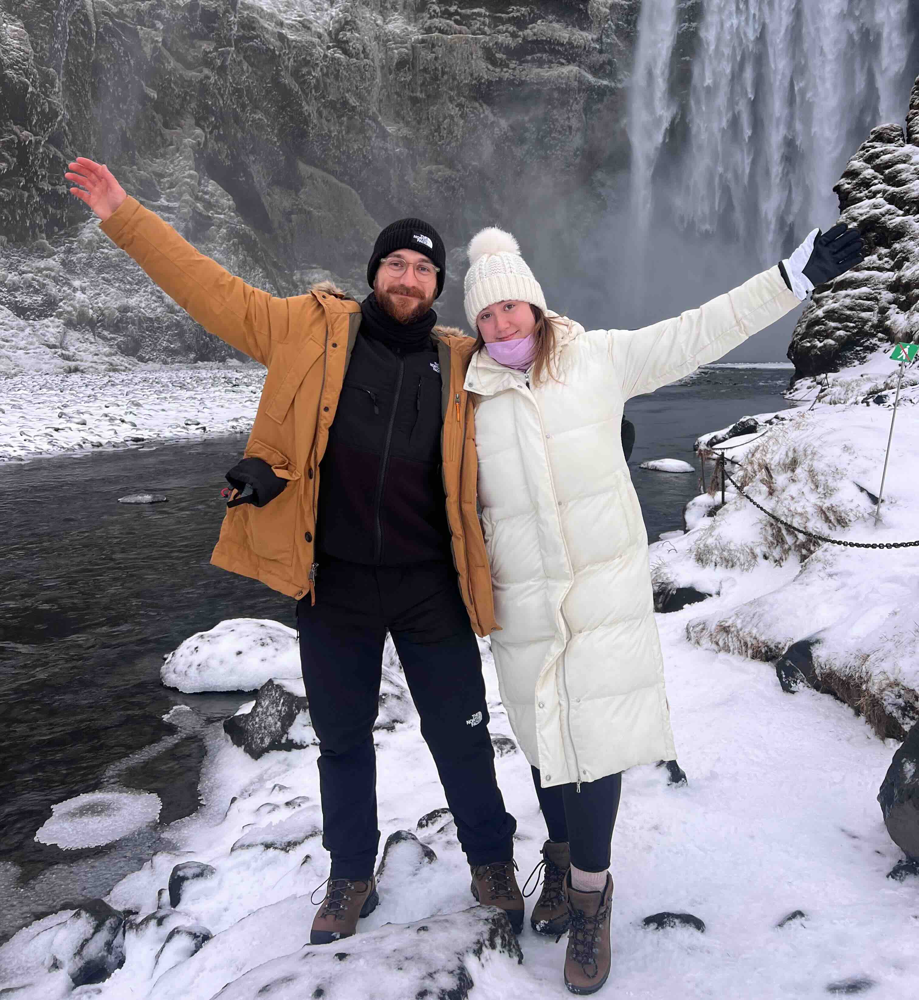

Hi <u>friends</u>, I'm Silviu. [[Contact|Get in touch]]! 

[[#Publications|Publications]] |
<a href="https://scholar.google.com/citations?user=IOVYUDwAAAAJ" target="_blank" rel="noopener noreferrer">Google Scholar</a>
<a href="https://www.semanticscholar.org/author/2066295029" target="_blank" rel="noopener noreferrer">Semantic Scholar</a>
<a href="https://orcid.org/0009-0006-7038-5489" target="_blank" rel="noopener noreferrer">ORCiD</a>
<a href="https://www.webofscience.com/wos/author/record/JJE-8903-2023" target="_blank" rel="noopener noreferrer">Web of Science</a>

✝ Catholic husband, and computer scientist. 📚 Interested in Theology, Philosophy and Artificial Intelligence. 
💻 Vice-President (GenAI) at JP Morgan. Previously Principal Engineer for Samsung, Applied Scientist for Amazon, and software engineer in startups. 
🎓 PhD in Data Science from the University of Edinburgh (<a href="https://smash.inf.ed.ac.uk/" target="_blank" rel="noopener noreferrer">SMASH group</a>). MSc in CS from Oxford. 

I'm currently at JP Morgan working on <a href="https://www.jpmorgan.com/technology/news/llmsuite-ab-award" target="_blank" rel="noopener noreferrer">LLMSuite</a>.
While at Samsung, we published a <a href="https://aclanthology.org/2024.emnlp-main.656/" target="_blank" rel="noopener noreferrer">paper</a> (EMNLP 2024) that introduces a parameter-efficient **guardrail** for LLMs.
I am also very interested in questions related to **AI ethics**, what we mean by *intelligence*, and how the rational soul (see
<a href="https://www.vatican.va/roman_curia/congregations/cfaith/documents/rc_ddf_doc_20250128_antiqua-et-nova_en.html" target="_blank" rel="noopener noreferrer">this</a>
and
<a href="https://www.dce.va/content/dam/dce/resources/en/digital-cultures/Encountering-AI---Ethical-and-Anthropological-Investigations.pdf" target="_blank" rel="noopener noreferrer">this</a>
) makes humans categorically different from so-called **AGI**. 
Check out my [[#Publications|publications]] for further interests.

 

> [!info] From the blog
> - Posts on [[Theology/0 Index|Theology and philosophy]] (coming soon ⏳)
> - A series of tutorials on [[Machine Learning/0 Index|machine learning and natural language processing]].
<!-- > - [[Coding/0 Index|Coding interview]] problems and solutions. -->

---

## News

- **28 July 2025**: I have joined an awesome team at JP Morgan as a Vice President (GenAI) (a couple of months ago)!
- **20 September 2024**: Our paper, <a href="https://aclanthology.org/2024.emnlp-main.656/" target="_blank" rel="noopener noreferrer">LoRA-Guard: Parameter-Efficient Guardrail Adaptation for Content Moderation of Large Language Models</a>, was accepted at EMNLP 2024. We introduce a parameter-efficient method for LLM guardrailing. It outperforms existing approaches with 100-1000x lower parameter overhead, bringing us closer to on-device content moderation.
- **20 May 2024**: Excited to announce that I've joined Samsung R&D Institute (UK) as a Principal Engineer 🚀. Thanks to everyone at Amazon for the last two years.
- **3 March 2023**: I passed my PhD viva with no reviewable corrections 🥳! Thanks be to God 🙏🏻; to my supervisors <a href="https://homepages.inf.ed.ac.uk/wmagdy/" target="_blank" rel="noopener noreferrer">Walid Magdy</a>, <a href="https://homepages.inf.ed.ac.uk/bonnie/" target="_blank" rel="noopener noreferrer">Bonnie Webber</a>, and <a href="https://mariawolters.net/" target="_blank" rel="noopener noreferrer">Maria Wolters</a>; and to my examiners <a href="https://sites.google.com/view/alexandra-birch/" target="_blank" rel="noopener noreferrer">Alexandra Birch-Mayne</a> and <a href="https://web.eecs.umich.edu/~mihalcea/" target="_blank" rel="noopener noreferrer">Rada Mihalcea</a>. Check out my thesis, <a href="https://era.ed.ac.uk/handle/1842/40531" target="_blank" rel="noopener noreferrer">Computational Sarcasm Detection and Understanding in Online Communication</a>.

Check out more news [[News|here]].

## Work

* **2025: Vice President (Generative AI) at JPMorgan** I'm currently at JP Morgan working on <a href="https://www.jpmorgan.com/technology/news/llmsuite-ab-award" target="_blank" rel="noopener noreferrer">LLMSuite</a>.
* **2024: Principal Engineer at Samsung R&D Institute (UK)** I've recently been working on LLM guardrailing. For instance, check out our paper, <a href="https://aclanthology.org/2024.emnlp-main.656/" target="_blank" rel="noopener noreferrer">LoRA-Guard: Parameter-Efficient Guardrail Adaptation for Content Moderation of Large Language Models</a> (EMNLP 2024)
* **2022 - 2024: Applied Scientist at Amazon Alexa AI** I've worked on improving the ability of large language models (LLMs) to generate responses that would provide Alexa customers with a more delightful experience.
* **2021: Applied Scientist (Intern) at Amazon Alexa AI**
* **2020: Research Scientist (Intern) at Huawei** I worked with <a href="https://scholar.google.co.uk/citations?user=804VsL8AAAAJ&hl=en" target="_blank" rel="noopener noreferrer">Haytham Assem</a> and <a href="https://scholar.google.com/citations?user=9y1l5IoAAAAJ&hl=en" target="_blank" rel="noopener noreferrer">Sourav Dutta</a> on learning transformations between monolingual word embedding spaces, to enable unsupervised translation and transfer learning to low-resource languages. Check out our <a href="https://aclanthology.org/2022.coling-1.92/" target="_blank" rel="noopener noreferrer">COLING 2022 paper</a> based on this work.
* **2019: Researcher at Frontier Development Lab** At <a href="https://fdleurope.org" target="_blank" rel="noopener noreferrer">Frontier Developemnt Lab</a>, we built a flood segmentation model. In the process, we collaborated with the European Space Agency and UNICEF. The model has now been deployed by SpaceX on an actual satellite 🛰. Our work was covered by <a href="https://www.ox.ac.uk/news/2021-06-29-artificial-intelligence-pioneered-oxford-detect-floods-launches-space" target="_blank" rel="noopener noreferrer">this</a> post from the University of Oxford; and by several media outlets: <a href="https://watchers.news/2021/07/11/worldfloods-ai-pioneered-at-oxford-for-global-flood-mapping-launches-into-space/" target="_blank" rel="noopener noreferrer">1</a>, <a href="https://www.innovationnewsnetwork.com/historic-breakthroughs-in-flood-mapping-from-space/24369/?utm_source=rss&utm_medium=rss&utm_campaign=historic-breakthroughs-in-flood-mapping-from-space" target="_blank" rel="noopener noreferrer">2</a>), <a href="https://www.homelandsecuritynewswire.com/dr20210712-detecting-floods-from-space-using-artificial-intelligence" target="_blank" rel="noopener noreferrer">3</a>, <a href="https://www.cas.cn/kj/202107/t20210722_4799503.shtml" target="_blank" rel="noopener noreferrer">4</a>, <a href="https://www.kepuchina.cn/more/202107/t20210722_3010644.shtml" target="_blank" rel="noopener noreferrer">5</a>. Check out our <a href="https://silviu-oprea.github.io/publications/#Mateo-Garcia2021" target="_blank" rel="noopener noreferrer">Nature (Scientific Reports) paper</a> and the <a href="https://www.nature.com/articles/s41598-021-86650-z" target="_blank" rel="noopener noreferrer">video of the rocket launch</a> 🚀
* **2014 - 2017: Engineer at VisualDNA and TheySay** During this time, I was an engineer at two tech startups. First, a software engineer at VisualDNA, a data science and management platform, where I worked on data aggregation and reporting using Scala and the Scalding interface to Hadoop. After VisualDNA, I spent some time as a contractor. Next, I was an artificial intelligence engineer at TheySay, a startup providing text analytics services, where I used technologies such as Scala and MongoDB. Both startups were acquired (after I left), see <a href="https://www.businessinsider.com/teddy-sagi-acquires-visualdna-2015-5?r=US&IR=T" target="_blank" rel="noopener noreferrer">this article about VisualDNA</a>, and <a href="https://www.aptean.com/fr/insights/press-release/aptean-expands-text-analytics-capabilities-with-theysay-acquisition" target="_blank" rel="noopener noreferrer">this one about TheySay</a>.
* **2012: Guest Researcher at the National Institute for Standards and Technology** I worked with <a href="https://www.nist.gov/people/bruce-r-miller" target="_blank" rel="noopener noreferrer">Bruce Miller</a> on extending <a href="https://math.nist.gov/~BMiller/LaTeXML/" target="_blank" rel="noopener noreferrer">LaTeXML</a>, a <a href="https://en.wikipedia.org/wiki/TeX" target="_blank" rel="noopener noreferrer">TeX</a> parser that he wrote in <a href="https://www.perl.org/" target="_blank" rel="noopener noreferrer">Perl</a>. The goal of my extenssion was to convert <a href="https://tikz.net/" target="_blank" rel="noopener noreferrer">TikZ</a> graphics to <a href="https://en.wikipedia.org/wiki/SVG" target="_blank" rel="noopener noreferrer">SVG</a>. See <a href="https://link.springer.com/chapter/10.1007/978-3-319-08434-3_32" target="_blank" rel="noopener noreferrer">this paper</a> that mentions my work.

## Education

- **2018 - 2023: PhD in Data Science at the University of Edinburgh** 
  Check out my thesis, <a href="https://era.ed.ac.uk/handle/1842/40531" target="_blank" rel="noopener noreferrer">Computational Sarcasm Detection and Understanding in Online Communication</a>. 
  In summary, I used computational methods to detect and understand the phenomenon of sarcasm, as it is manifested in online textual communication, together with my supervisors, <a href="https://homepages.inf.ed.ac.uk/wmagdy/" target="_blank" rel="noopener noreferrer">Walid Magdy</a>, <a href="https://homepages.inf.ed.ac.uk/bonnie/" target="_blank" rel="noopener noreferrer">Bonnie Webber</a>, and <a href="https://mariawolters.net/" target="_blank" rel="noopener noreferrer">Maria Wolters</a>. 
  More specifically, I built a dataset of texts annotated for sarcasm (<a href="https://aclanthology.org/2020.acl-main.118.pdf" target="_blank" rel="noopener noreferrer">ACL 2020 paper</a>), introduced sarcasm detection models (<a href="https://aclanthology.org/P19-1275.pdf" target="_blank" rel="noopener noreferrer">ACL 2019 paper</a>), and also organised a competition encouraging the community to build such models (<a href="https://aclanthology.org/2022.semeval-1.111.pdf" target="_blank" rel="noopener noreferrer">SemEval 2022 paper</a>). I showed that people of similar socio-demographic backgrounds understand each other's sarcasm more often than people of dissimilar backgrounds (<a href="https://doi.org/10.1145/3392834" target="_blank" rel="noopener noreferrer">CSCW 2022 paper</a>). Finally, I built a sarcastic chatbot (<a href="https://aclanthology.org/2021.emnlp-demo.38.pdf" target="_blank" rel="noopener noreferrer">EMNLP 2021 demo</a>), and investigated when it is appropriate for chatbots to be sarcastic, and how they should formulate their utterances (<a href="https://aclanthology.org/2022.acl-long.530.pdf" target="_blank" rel="noopener noreferrer">ACL 2022 paper</a>). 
  Along the way, I had fun as an intern at Frontier Development Lab in 2019 (<a href="https://www.nature.com/articles/s41598-021-86650-z" target="_blank" rel="noopener noreferrer">20201 Nature (Scientific Reports) paper</a>), at Huawei in 2020 (<a href="https://aclanthology.org/2022.coling-1.92/" target="_blank" rel="noopener noreferrer">COLING 2022 paper</a>), and at Amazon Alexa AI in 2021 (paper in the baking 👨🏻‍🍳). See below, in the _Work_ section.
- **2017 - 2018: MRes in Data Science at the University of Edinburgh** 
  I used computational methods to detect the presence of sarcasm in tweets, together with my supervisor, <a href="https://homepages.inf.ed.ac.uk/wmagdy/" target="_blank" rel="noopener noreferrer">Walid Magdy</a>.
- **2012 - 2013: MSc in Computer Science at the University of Oxford** 
  I worked with <a href="https://scholar.google.co.uk/citations?user=eJwbbXEAAAAJ" target="_blank" rel="noopener noreferrer">Phil Blunsom</a> on building character-level language models for the Romanian language using recurrent neural networks.
- **2009 - 2012: BSc in Computer Science at Jacobs University Bremen** This is where my interest in natural language processing was triggered, working with <a href="https://kwarc.info/people/mkohlhase/" target="_blank" rel="noopener noreferrer">Michael Kohlhase</a>.

## Media Coverage

- Our paper, <a href="https://arxiv.org/abs/2407.02987" target="_blank" rel="noopener noreferrer">LoRA-Guard: Parameter-Efficient Guardrail Adaptation for Content Moderation of Large Language Models</a>, has been covered by: <a href="https://www.marktechpost.com/2024/07/14/samsung-researchers-introduce-lora-guard-a-parameter-efficient-guardrail-adaptation-method-that-relies-on-knowledge-sharing-between-llms-and-guardrail-models/" target="_blank" rel="noopener noreferrer">MarcTechPost</a>; and <a href="https://blog.adhilroshan.me/introducing-lora-guard-a-breakthrough-in-ai-content-moderation" target="_blank" rel="noopener noreferrer">this</a> blog post.
- Our paper, <a href="https://www.nature.com/articles/s41598-021-86650-z" target="_blank" rel="noopener noreferrer">Towards global flood mapping onboard low cost satellites with machine learning</a>, published in Nature (Scientific Reports) in 2021, was covered by the following articles:
  - University of Oxford: <a href="https://www.ox.ac.uk/news/2021-06-29-artificial-intelligence-pioneered-oxford-detect-floods-launches-space" target="_blank" rel="noopener noreferrer">Artificial Intelligence pioneered at Oxford to detect floods launches into space</a>
  - The Watchers: <a href="https://watchers.news/2021/07/11/worldfloods-ai-pioneered-at-oxford-for-global-flood-mapping-launches-into-space/" target="_blank" rel="noopener noreferrer">WorldFloods – AI pioneered at Oxford for global flood mapping launches into space</a>
  - Innovation News Network: <a href="https://www.innovationnewsnetwork.com/historic-breakthroughs-in-flood-mapping-from-space/24369/?utm_source=rss&utm_medium=rss&utm_campaign=historic-breakthroughs-in-flood-mapping-from-space" target="_blank" rel="noopener noreferrer">A look at historic breakthroughs in flood mapping from space</a>
  - Homeland Security News Wire: <a href="https://www.homelandsecuritynewswire.com/dr20210712-detecting-floods-from-space-using-artificial-intelligence" target="_blank" rel="noopener noreferrer">Detecting Floods from Space Using Artificial Intelligence</a>
  - Chinese Academy of Sciences: <a href="https://www.cas.cn/kj/202107/t20210722_4799503.shtml" target="_blank" rel="noopener noreferrer">AI加持遥感技术能否为防汛"备料"</a>
  - China Science Communication: <a href="https://www.kepuchina.cn/more/202107/t20210722_3010644.shtml" target="_blank" rel="noopener noreferrer">AI加持，遥瞰洪涛</a>

## Patents

My Google Patents page is [here](https://patents.google.com/?inventor=Silviu+Oprea&oq=inventor:(Silviu+Oprea)).

- Processing communications in a computing arrangement for semantic understanding and interpretation of code-switching (<a href="https://worldwide.espacenet.com/patent/search/family/072709373/publication/WO2022069030A1?q=WO2022069030A1&queryLang=en%3Ade%3Afr" target="_blank" rel="noopener noreferrer">html</a>) 
  Sourav Dutta, <u>Silviu Vlad Oprea</u>, Haytham Assem, and Hu Peng 
  _Patent WO2022069030A1 issued from application PCT/EP2020/077336_. 2022.

## Publications

Check the full list of publications on <a href="https://scholar.google.com/citations?user=IOVYUDwAAAAJ" target="_blank" rel="noopener noreferrer">my Google Scholar profile</a>.

Safety and bias of generative models:
- **LoRA-Guard: Parameter-Efficient Guardrail Adaptation for Content Moderation of Large Language Models** (<a href="https://aclanthology.org/2024.emnlp-main.656/" target="_blank" rel="noopener noreferrer">pdf</a>) 
  Hayder Elesedy, Pedro M. Esperança, <u>Silviu Vlad Oprea</u>, and Mete Ozay 
  _Proceedings of the 2024 Conference on Empirical Methods in Natural Language Processing: System Demonstrations_. 2024.

Figurative language comprehension:
- **Sarcasm Detection is Way Too Easy! An Empirical Comparison of Human and Machine Sarcasm Detection** (<a href="https://aclanthology.org/2022.findings-emnlp.387.pdf" target="_blank" rel="noopener noreferrer">pdf</a>) 
  Ibrahim Abu Farha, Steven Wilson, <u>Silviu Vlad Oprea</u>, and Walid Magdy 
  _Findings of the Association for Computational Linguistics_. 2022.

- **SemEval-2022 Task 6: iSarcasmEval, Intended Sarcasm Detection in English and Arabic** (<a href="https://aclanthology.org/2022.semeval-1.111.pdf" target="_blank" rel="noopener noreferrer">pdf</a>, <a href="https://aclanthology.org/2022.semeval-1.111.mp4" target="_blank" rel="noopener noreferrer">video</a>) 
  Ibrahim Abu Farha, <u>Silviu Vlad Oprea</u>, Steven Wilson, and Walid Magdy 
  _Proceedings of the 16th International Workshop on Semantic Evaluation (SemEval-2022)_. 2022.

- **iSarcasm: A Dataset of Intended Sarcasm** (<a href="https://aclanthology.org/2020.acl-main.118.pdf" target="_blank" rel="noopener noreferrer">pdf</a>, <a href="http://slideslive.com/38929208" target="_blank" rel="noopener noreferrer">video</a>) 
  <u>Silviu Vlad Oprea</u>, and Walid Magdy 
  _Proceedings of the 58th Annual Meeting of the Association for Computational Linguistics_. 2020.

- **Exploring Author Context for Detecting Intended vs Perceived Sarcasm** (<a href="https://aclanthology.org/P19-1275.pdf" target="_blank" rel="noopener noreferrer">pdf</a>, <a href="https://vimeo.com/384744638" target="_blank" rel="noopener noreferrer">video</a>) 
  <u>Silviu Vlad Oprea</u>, and Walid Magdy 
  _Proceedings of the 57th Annual Meeting of the Association for Computational Linguistics_. 2019.

Computational social science:

- **Should a Chatbot be Sarcastic? Understanding User Preferences Towards Sarcasm Generation** (<a href="https://aclanthology.org/2022.acl-long.530.pdf" target="_blank" rel="noopener noreferrer">pdf</a>, <a href="https://aclanthology.org/2022.acl-long.530.mp4" target="_blank" rel="noopener noreferrer">video</a>) 
  <u>Silviu Vlad Oprea</u>, Steven Wilson, and Walid Magdy 
  _Proceedings of the 60th Annual Meeting of the Association for Computational Linguistics_. 2022.

- **The Effect of Sociocultural Variables on Sarcasm Communication Online** (<a href="https://arxiv.org/pdf/2004.04945.pdf" target="_blank" rel="noopener noreferrer">pdf</a>, <a href="https://dl.acm.org/doi/abs/10.1145/3392834" target="_blank" rel="noopener noreferrer">html</a>) 
  <u>Silviu Vlad Oprea</u>, and Walid Magdy 
  _Proceedings of the ACM on Human-Computer Interaction_. 2020.

- **Chandler: An Explainable Sarcastic Response Generator** (<a href="https://aclanthology.org/2021.emnlp-demo.38.pdf" target="_blank" rel="noopener noreferrer">pdf</a>, <a href="https://aclanthology.org/2021.emnlp-demo.38.mp4" target="_blank" rel="noopener noreferrer">video</a>) 
  <u>Silviu Vlad Oprea</u>, Steven Wilson, and Walid Magdy 
  _Proceedings of the 2021 Conference on Empirical Methods in Natural Language Processing: System Demonstrations_. 2021.

Multilinguality:
- **Multi-Stage Framework with Refinement Based Point Set Registration for Unsupervised Bi-Lingual Word Alignment** (<a href="https://aclanthology.org/2022.coling-1.92.pdf" target="_blank" rel="noopener noreferrer">pdf</a>) 
  <u>Silviu Vlad Oprea</u>, Sourav Dutta, and Haytham Assem 
  _Proceedings of the 29th International Conference on Computational Linguistics_. 2022.

Computer vision:
- **Towards global flood mapping onboard low cost satellites with machine learning** (<a href="https://www.nature.com/articles/s41598-021-86650-z" target="_blank" rel="noopener noreferrer">html</a>) 
  Gonzalo Mateo-Garcia*, Joshua Veitch-Michaelis*, Lewis Smith*, <u>Silviu Vlad Oprea</u>, Guy Schumann, Yarin Gal, Atılım Güneş Baydin, and Dietmar Backes 
  _Nature (Scientific Reports)_. 2021.

\* indicates equal contribution.
## Teaching
- **2021**: Lab demonstrator for Text Technologies in Data Science at the University of Edinburgh.
- **2010 and 2011**: Teaching assistant for Programming in C/C++ at Jacobs University Bremen.
## Talks
This list does not include conference presentations of my papers.

2023 and 2024:
- Talk entitled "Socio-demographic considerations in natural language processing: case studies from investigating sarcasm​", at Sabancı University, Türkiye (online).
- Talk about my work on sarcasm detection and understanding, at Oakland University, MI, USA (online).
- Talk about my work on sarcasm detection and understanding, at the Technical University of Cluj-Napoca, Romania (online).
