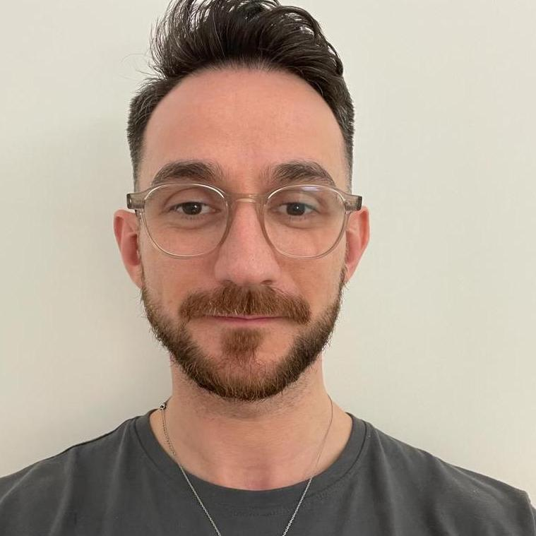

Hi <u>friends</u>, I'm Silviu. [[Contact|Get in touch]]! 

[[#Publications|Publications]] |
[Google Scholar](https://scholar.google.com/citations?user=IOVYUDwAAAAJ)
[Semantic Scholar](https://www.semanticscholar.org/author/2066295029)
[ORCiD](https://orcid.org/0009-0006-7038-5489)
[Web of Science](https://www.webofscience.com/wos/author/record/JJE-8903-2023)

✝ Catholic, husband, and computer scientist; 
🎓 PhD in Data Science from the University of Edinburgh ([SMASH group](https://smash.inf.ed.ac.uk/)); MSc in Computer Science from the University of Oxford; 
💻 Worked as a software engineer in start-ups; Applied Scientist for Amazon; Research Scientist for Huawei; and Principal Engineer for Samsung.  
📚 Interested in Theology and Philosophy; and Artificial Intelligence.

> [!info] From the blog
> - Posts on [[Theology/0 Index|Theology and philosophy]] (coming soon ⏳)
> - A series of tutorials on [[Machine Learning/0 Index|machine learning and natural language processing]].
> - [[Coding/0 Index|Coding interview]] problems and solutions.

My recent work has focused on the safety of AI agents.
For instance, in a recent [paper](https://aclanthology.org/2024.emnlp-main.656/) (EMNLP 2024), we introduce a **parameter-efficient guardrailing method for large language models**.
I am also interested in how safety standards are influenced by socio-demographic factors.
Further interests in this direction include **training AI agents**, particularly in a way that maximises **multilingual performance** and avoids memorising **harmful biases**; and evaluating them, particularly on tasks where the correct output is a function of **socio-demographic factors** (such a task is commomnsense inference).

---
## News
<!--**2 January 2025**: Goodbye Samsung R&D Institute (UK). It had a lot of fun as a Principal Engineer. I am now an entrepreneur.-->
- **20 September 2024**: Our paper, [LoRA-Guard: Parameter-Efficient Guardrail Adaptation for Content Moderation of Large Language Models](https://aclanthology.org/2024.emnlp-main.656/), was accepted at EMNLP 2024. We introduce a parameter-efficient method for LLM guardrailing. It outperforms existing approaches with 100-1000x lower parameter overhead, bringing us closer to on-device content moderation.
- **20 May 2024**: Excited to announce that I've joined Samsung R&D Institute (UK) as a Principal Engineer 🚀. Thanks to everyone at Amazon for the last two years.
- **3 March 2023**: I passed my PhD viva with no reviewable corrections 🥳! Thanks be to God 🙏🏻; to my supervisors [Walid Magdy](https://homepages.inf.ed.ac.uk/wmagdy/), [Bonnie Webber](https://homepages.inf.ed.ac.uk/bonnie/), and [Maria Wolters](https://mariawolters.net/); and to my examiners [Alexandra Birch-Mayne](https://sites.google.com/view/alexandra-birch/) and [Rada Mihalcea](https://web.eecs.umich.edu/~mihalcea/). Check out my thesis, [Computational Sarcasm Detection and Understanding in Online Communication](https://era.ed.ac.uk/handle/1842/40531).

Check out more news [[News|here]].
## Work
* **2024: Principal Engineer at Samsung R&D Institute (UK)** I've recently been working on LLM guardrailing. For instance, check out our paper, [LoRA-Guard: Parameter-Efficient Guardrail Adaptation for Content Moderation of Large Language Models](https://aclanthology.org/2024.emnlp-main.656/) (EMNLP 2024)
* **2022 - 2024: Applied Scientist at Amazon Alexa AI** I've worked on improving the ability of large language models (LLMs) to generate responses that would provide Alexa customers with a more delightful experience.
* **2021: Applied Scientist (Intern) at Amazon Alexa AI**
* **2020: Research Scientist (Intern) at Huawei** I worked with [Haytham Assem](https://scholar.google.co.uk/citations?user=804VsL8AAAAJ&hl=en) and [Sourav Dutta](https://scholar.google.com/citations?user=9y1l5IoAAAAJ&hl=en) on learning transformations between monolingual word embedding spaces, to enable unsupervised translation and transfer learning to low-resource languages. Check out our [COLING 2022 paper](https://aclanthology.org/2022.coling-1.92/) based on this work.
* **2019: Researcher at Frontier Development Lab** At [Frontier Developemnt Lab](https://fdleurope.org), we built a flood segmentation model. In the process, we collaborated with the European Space Agency and UNICEF. The model has now been deployed by SpaceX on an actual satellite 🛰. Our work was covered by [this](https://www.ox.ac.uk/news/2021-06-29-artificial-intelligence-pioneered-oxford-detect-floods-launches-space) post from the University of Oxford; and by several media outlets: [1](https://watchers.news/2021/07/11/worldfloods-ai-pioneered-at-oxford-for-global-flood-mapping-launches-into-space/), [2](https://www.innovationnewsnetwork.com/historic-breakthroughs-in-flood-mapping-from-space/24369/?utm_source=rss&utm_medium=rss&utm_campaign=historic-breakthroughs-in-flood-mapping-from-space)), [3](https://www.homelandsecuritynewswire.com/dr20210712-detecting-floods-from-space-using-artificial-intelligence), [4](https://www.cas.cn/kj/202107/t20210722_4799503.shtml), [5](https://www.kepuchina.cn/more/202107/t20210722_3010644.shtml). Check out our [Nature (Scientific Reports) paper](https://silviu-oprea.github.io/publications/#Mateo-Garcia2021) and the [video of the rocket launch](https://www.nature.com/articles/s41598-021-86650-z) 🚀
* **2014 - 2017: Engineer at VisualDNA and TheySay** During this time, I was an engineer at two tech startups. First, a software engineer at VisualDNA, a data science and management platform, where I worked on data aggregation and reporting using Scala and the Scalding interface to Hadoop. After VisualDNA, I spent some time as a contractor. Next, I was an artificial intelligence engineer at TheySay, a startup providing text analytics services, where I used technologies such as Scala and MongoDB. Both startups were acquired (after I left), see [this article about VisualDNA](https://www.businessinsider.com/teddy-sagi-acquires-visualdna-2015-5?r=US&IR=T), and [this one about TheySay](https://www.aptean.com/fr/insights/press-release/aptean-expands-text-analytics-capabilities-with-theysay-acquisition).
* **2012: Guest Researcher at the National Institute for Standards and Technology** I worked with [Bruce Miller](https://www.nist.gov/people/bruce-r-miller) on extending [LaTeXML](https://math.nist.gov/~BMiller/LaTeXML/), a [TeX](https://en.wikipedia.org/wiki/TeX) parser that he wrote in [Perl](https://www.perl.org/). The goal of my extenssion was to convert [TikZ](https://tikz.net/) graphics to [SVG](https://en.wikipedia.org/wiki/SVG). See [this paper](https://link.springer.com/chapter/10.1007/978-3-319-08434-3_32) that mentions my work.
## Education
- **2018 - 2023: PhD in Data Science at the University of Edinburgh** 
  Check out my thesis, [Computational Sarcasm Detection and Understanding in Online Communication](https://era.ed.ac.uk/handle/1842/40531). 
  In summary, I used computational methods to detect and understand the phenomenon of sarcasm, as it is manifested in online textual communication, together with my supervisors, [Walid Magdy](https://homepages.inf.ed.ac.uk/wmagdy/), [Bonnie Webber](https://homepages.inf.ed.ac.uk/bonnie/), and [Maria Wolters](https://mariawolters.net/). 
  More specifically, I built a dataset of texts annotated for sarcasm ([ACL 2020 paper](https://aclanthology.org/2020.acl-main.118.pdf)), introduced sarcasm detection models ([ACL 2019 paper](https://aclanthology.org/P19-1275.pdf)), and also organised a competition encouraging the community to build such models ([SemEval 2022 paper](https://aclanthology.org/2022.semeval-1.111.pdf)). I showed that people of similar socio-demographic backgrounds understand each other's sarcasm more often than people of dissimilar backgrounds ([CSCW 2022 paper](https://doi.org/10.1145/3392834)). Finally, I built a sarcastic chatbot ([EMNLP 2021 demo](https://aclanthology.org/2021.emnlp-demo.38.pdf)), and investigated when it is appropriate for chatbots to be sarcastic, and how they should formulate their utterances ([ACL 2022 paper](https://aclanthology.org/2022.acl-long.530.pdf)). 
  Along the way, I had fun as an intern at Frontier Development Lab in 2019 ([20201 Nature (Scientific Reports) paper](https://www.nature.com/articles/s41598-021-86650-z)), at Huawei in 2020 ([COLING 2022 paper](https://aclanthology.org/2022.coling-1.92/)), and at Amazon Alexa AI in 2021 (paper in the baking 👨🏻‍🍳). See below, in the _Work_ section.
- **2017 - 2018: MRes in Data Science at the University of Edinburgh** 
  I used computational methods to detect the presence of sarcasm in tweets, together with my supervisor, [Walid Magdy](https://homepages.inf.ed.ac.uk/wmagdy/).
- **2012 - 2013: MSc in Computer Science at the University of Oxford** 
  I worked with [Phil Blunsom](https://scholar.google.co.uk/citations?user=eJwbbXEAAAAJ) on building character-level language models for the Romanian language using recurrent neural networks.
- **2009 - 2012: BSc in Computer Science at Jacobs University Bremen** This is where my interest in natural language processing was triggered, working with [Michael Kohlhase](https://kwarc.info/people/mkohlhase/).
## Media Coverage
- Our paper, [LoRA-Guard: Parameter-Efficient Guardrail Adaptation for Content Moderation of Large Language Models](https://arxiv.org/abs/2407.02987), has been covered by: [MarcTechPost](https://www.marktechpost.com/2024/07/14/samsung-researchers-introduce-lora-guard-a-parameter-efficient-guardrail-adaptation-method-that-relies-on-knowledge-sharing-between-llms-and-guardrail-models/); and [this](https://blog.adhilroshan.me/introducing-lora-guard-a-breakthrough-in-ai-content-moderation) blog post.
- Our paper, [Towards global flood mapping onboard low cost satellites with machine learning](https://www.nature.com/articles/s41598-021-86650-z), published in Nature (Scientific Reports) in 2021, was covered by the following articles:
	- University of Oxford: [Artificial Intelligence pioneered at Oxford to detect floods launches into space](https://www.ox.ac.uk/news/2021-06-29-artificial-intelligence-pioneered-oxford-detect-floods-launches-space)
	- The Watchers: [WorldFloods – AI pioneered at Oxford for global flood mapping launches into space](https://watchers.news/2021/07/11/worldfloods-ai-pioneered-at-oxford-for-global-flood-mapping-launches-into-space/)
	- Innovation News Network: [A look at historic breakthroughs in flood mapping from space](https://www.innovationnewsnetwork.com/historic-breakthroughs-in-flood-mapping-from-space/24369/?utm_source=rss&utm_medium=rss&utm_campaign=historic-breakthroughs-in-flood-mapping-from-space)
	- Homeland Security News Wire: [Detecting Floods from Space Using Artificial Intelligence](https://www.homelandsecuritynewswire.com/dr20210712-detecting-floods-from-space-using-artificial-intelligence)
	- Chinese Academy of Sciences: [AI加持遥感技术能否为防汛"备料"](https://www.cas.cn/kj/202107/t20210722_4799503.shtml)
	- China Science Communication: [AI加持，遥瞰洪涛](https://www.kepuchina.cn/more/202107/t20210722_3010644.shtml)
## Patents
My Google Patents page is [here](https://patents.google.com/?inventor=Silviu+Oprea&oq=inventor:(Silviu+Oprea)).

- Processing communications in a computing arrangement for semantic understanding and interpretation of code-switching ([html](https://worldwide.espacenet.com/patent/search/family/072709373/publication/WO2022069030A1?q=WO2022069030A1&queryLang=en%3Ade%3Afr)) 
  Sourav Dutta, <u>Silviu Vlad Oprea</u>, Haytham Assem, and Hu Peng 
  _Patent WO2022069030A1 issued from application PCT/EP2020/077336_. 2022.

## Publications
Check the full list of publications on [my Google Scholar profile](https://scholar.google.com/citations?user=IOVYUDwAAAAJ).

Safety and bias of generative models:
- **LoRA-Guard: Parameter-Efficient Guardrail Adaptation for Content Moderation of Large Language Models** ([pdf](https://aclanthology.org/2024.emnlp-main.656/)) 
  Hayder Elesedy, Pedro M. Esperança, <u>Silviu Vlad Oprea</u>, and Mete Ozay 
  _Proceedings of the 2024 Conference on Empirical Methods in Natural Language Processing: System Demonstrations_. 2024.

Figurative language comprehension:
- **Sarcasm Detection is Way Too Easy! An Empirical Comparison of Human and Machine Sarcasm Detection** ([pdf](https://aclanthology.org/2022.findings-emnlp.387.pdf)) 
  Ibrahim Abu Farha, Steven Wilson, <u>Silviu Vlad Oprea</u>, and Walid Magdy 
  _Findings of the Association for Computational Linguistics_. 2022.

- **SemEval-2022 Task 6: iSarcasmEval, Intended Sarcasm Detection in English and Arabic** ([pdf](https://aclanthology.org/2022.semeval-1.111.pdf), [video](https://aclanthology.org/2022.semeval-1.111.mp4)) 
  Ibrahim Abu Farha, <u>Silviu Vlad Oprea</u>, Steven Wilson, and Walid Magdy 
  _Proceedings of the 16th International Workshop on Semantic Evaluation (SemEval-2022)_. 2022.

- **iSarcasm: A Dataset of Intended Sarcasm** ([pdf](https://aclanthology.org/2020.acl-main.118.pdf), [video](http://slideslive.com/38929208)) 
  <u>Silviu Vlad Oprea</u>, and Walid Magdy 
  _Proceedings of the 58th Annual Meeting of the Association for Computational Linguistics_. 2020.

- **Exploring Author Context for Detecting Intended vs Perceived Sarcasm** ([pdf](https://aclanthology.org/P19-1275.pdf), [video](https://vimeo.com/384744638)) 
  <u>Silviu Vlad Oprea</u>, and Walid Magdy 
  _Proceedings of the 57th Annual Meeting of the Association for Computational Linguistics_. 2019.

Computational social science:

- **Should a Chatbot be Sarcastic? Understanding User Preferences Towards Sarcasm Generation** ([pdf](https://aclanthology.org/2022.acl-long.530.pdf), [video](https://aclanthology.org/2022.acl-long.530.mp4)) 
  <u>Silviu Vlad Oprea</u>, Steven Wilson, and Walid Magdy 
  _Proceedings of the 60th Annual Meeting of the Association for Computational Linguistics_. 2022.

- **The Effect of Sociocultural Variables on Sarcasm Communication Online** ([pdf](https://arxiv.org/pdf/2004.04945.pdf), [html](https://dl.acm.org/doi/abs/10.1145/3392834)) 
  <u>Silviu Vlad Oprea</u>, and Walid Magdy 
  _Proceedings of the ACM on Human-Computer Interaction_. 2020.

- **Chandler: An Explainable Sarcastic Response Generator** ([pdf](https://aclanthology.org/2021.emnlp-demo.38.pdf), [video](https://aclanthology.org/2021.emnlp-demo.38.mp4)) 
  <u>Silviu Vlad Oprea</u>, Steven Wilson, and Walid Magdy 
  _Proceedings of the 2021 Conference on Empirical Methods in Natural Language Processing: System Demonstrations_. 2021.

Multilinguality:
- **Multi-Stage Framework with Refinement Based Point Set Registration for Unsupervised Bi-Lingual Word Alignment** ([pdf](https://aclanthology.org/2022.coling-1.92.pdf)) 
  <u>Silviu Vlad Oprea</u>, Sourav Dutta, and Haytham Assem 
  _Proceedings of the 29th International Conference on Computational Linguistics_. 2022.

Computer vision:
- **Towards global flood mapping onboard low cost satellites with machine learning** ([html](https://www.nature.com/articles/s41598-021-86650-z)) 
  Gonzalo Mateo-Garcia*, Joshua Veitch-Michaelis*, Lewis Smith*, <u>Silviu Vlad Oprea</u>, Guy Schumann, Yarin Gal, Atılım Güneş Baydin, and Dietmar Backes 
  _Nature (Scientific Reports)_. 2021.

\* indicates equal contribution.
## Teaching
- **2021**: Lab demonstrator for Text Technologies in Data Science at the University of Edinburgh.
- **2010 and 2011**: Teaching assistant for Programming in C/C++ at Jacobs University Bremen.
## Talks
This list does not include conference presentations of my papers.

2023 and 2024:
- Talk entitled "Socio-demographic considerations in natural language processing: case studies from investigating sarcasm​", at Sabancı University, Türkiye (online).
- Talk about my work on sarcasm detection and understanding, at Oakland University, MI, USA (online).
- Talk about my work on sarcasm detection and understanding, at the Technical University of Cluj-Napoca, Romania (online).
